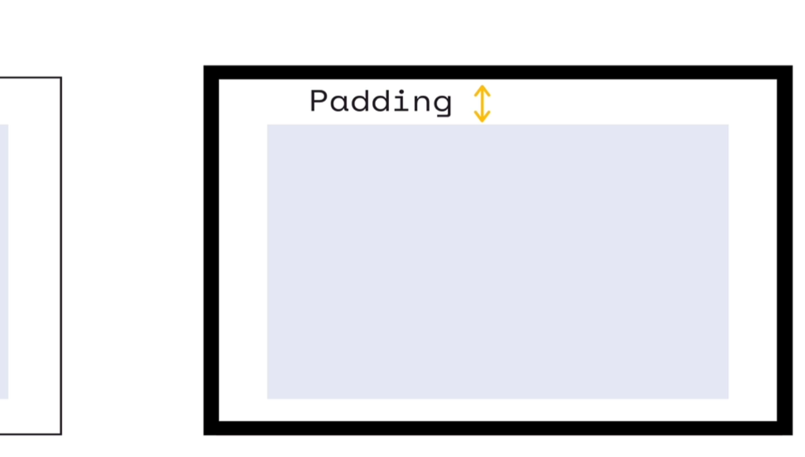
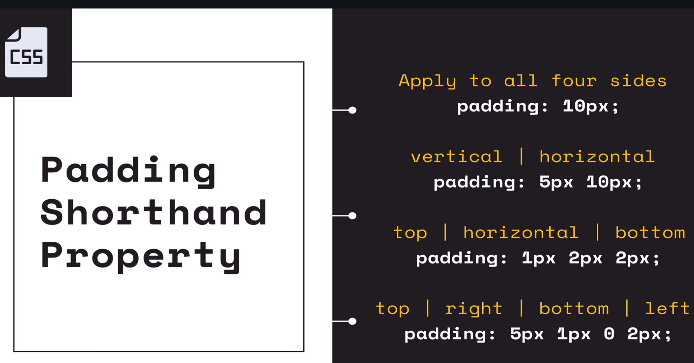

## 1. Border Properties
[link to mdn_border-style](https://developer.mozilla.org/en-US/docs/Web/CSS/border-style)
- border-width
Controls the thickness of the border.
- border-color
Controls the color.
-border-style
Controls the line style- dashed, solid, wavy etc.

**shorthand property to assign border values**

border:medium dashed green; ( width|style|color)
example

```html
<div class="card">
  
  <h1>I Am Dog</h1>
</div>
```
```css
.card{
    width:210px;
    border-color: grey;
    border-width: 1px;
    border-radius: 5px;
    border-style: solid;
    text-align: center;
}
img{
    width:200px;
    border: 5px solid rgb(236, 183, 191);
    border-radius: 50%;
}
```
## 2. Padding

[mdn_padding_link](https://developer.mozilla.org/en-US/docs/Web/CSS/padding)

Padding is the space between the content, the actual content box, and the border of an element.
Intuitive example: padding between the item and box while shipping something.



- some major properties:
```css
element {
    padding-top: 10px;
    padding-right: 10px;
    padding-bottom: 10px;
    padding: 10px; /* padding around*/

}
element {
    padding: 10px 20px 15px 5px; /* top right bottom left */
}
```
- shorthand property


```css
button{
    padding: 20px;
    /* vertical|horizontal */
    padding: 5px 20px;
    /* top|horizontal|bottom */
    padding: 5px 20px 2px;
    /* clockwise all sides starting from top */
    padding: 5px 5px 5px 0px;
}
```
## 3. Margin
[mdn_margin_link](https://developer.mozilla.org/en-US/docs/Web/CSS/margin)

Margin is the space outside of an elements border. Between that elements and other elements.
So padding is the spacing on the inside of the border. Margin is the spacing on the outside.

```css
div{
    margin-left: 20px;
margin-right: 10px;
margin-bottom: 2px;
margin-top: 1em;
}
```
- shorthand property, same as padding.
```css
button{
    margin: 20px;
    /* vertical|horizontal */
    margin: 5px 20px;
    /* top|horizontal|bottom */
    margin: 5px 20px 2px;
    /* clockwise all sides starting from top */
    margin: 5px 5px 5px 0px;
}
```
## Display property

The `display` property in CSS is used to define how an HTML element should be displayed on the page.
[mdn_display_link](https://developer.mozilla.org/en-US/docs/Web/CSS/display)
1. Inline
Width and heights are ignored. Margina and padding push elements away horizontally but not vertically. <span> default inline.
```css
h1{
    display:inline;
}```

2. Block
Block elements break the flow of the document. Width, Height, Margin, and Padding are respected. h1..h6 default block.
```css
span{
    display: block; /*span's default property is inline.*/
}
```
3. Inline-Block
Behave like an inline element except Width, Height, Margin, and Padding are respected.
```css
div{
    height: 200px;
    width: 200px;
    background-color: olivedrab;
    border: 2px solid black;
    display: inline-block; /* should use inline-block instead of inline to function*/
    margin: 50px;
}
- display:none is used to hide the display
```